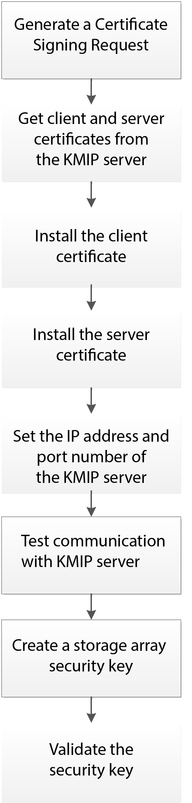

= Getting started with external key management
:icons: font
:imagesdir: ./media/

[.lead]
A security key is a string of characters, which is shared between the secure-enabled drives and controllers in a storage array. When using external key management, you create and maintain security keys on a key management server

See SANtricity System Manager online help for conceptual information on using external key management servers and security keys. The following graphic shows the basic workflow for implementing external security keys:

== Workflow steps

Both certificate management and external key management are new security features with the SANtricity11.40 release. To get started, use the following basic steps:

. Generate a Certificate signing request using the `save storageArray keyManagementClientCSR` command. See xref:wombat-save-storagearray-keymanagementclientcsr.adoc[Generate Key Management certificate signing request].
. From the KMIP server, request a client and a server certificate.
. Install the client certificate using the `download storageArray keyManagementCertificate` command with the `certificateType` parameter set to `client`. See xref:wombat-download-storagearray-keymanagementcertificate.adoc[Install storage array external key management certificate].
. Install the server certificate using the `download storageArray keyManagementCertificate` command with the `certificateType` parameter set to `server`. See xref:wombat-download-storagearray-keymanagementcertificate.adoc[Install storage array external key management certificate].
. Set the IP address and port number of the key management server using the `set storageArray externalKeyManagement` command. See xref:wombat-set-storagearray-externalkeymanagement.adoc[Set external key management settings].
. Test communication with the external key management server using the `start storageArray externalKeyManagement test` command. See xref:wombat-start-storagearray-externalkeymanagement-test.adoc[Test external key management communication].
. Create a security key using the `create storageArray securityKey` command. See xref:wombat-create-storagearray-securitykey.adoc[Create security key].
. Validate the security key using the `validate storageArray securityKey` command. See xref:wombat-validate-storagearray-securitykey.adoc[Validate internal or external security key].
