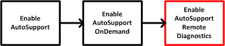

= Enable or disable the AutoSupport Remote Diagnostics feature (for individual E2800 or E5700 arrays)
:icons: font
:imagesdir: ./media/

[.lead]
The `set storageArray autoSupportRemoteDiag` command turns on or turns off the AutoSupport OnDemand Remote Diagnostics feature. This feature enables technical support to request support data to diagnose problems remotely.

== Supported Arrays

This command applies to an individual E2800, E5700, EF600 or EF300 storage array. It does not operate on E2700 or E5600 storage arrays.

== Roles

To execute this command on an E2800, E5700, EF600, or EF300 storage array, you must have the Storage Admin or Support Admin role.

== Context

Before enabling this feature, first enable the AutoSupport feature and then the AutoSupport OnDemand feature on the storage array. You must enable the three features in this order:

== Syntax

----
set storageArray autoSupportRemoteDiag (enable | disable)
----

== Parameters

|===
| Parameter| Description
a|
`enable | disable`
a|
Allows the user to enable or disable AutoSupport Remote Diagnostics feature. If AutoSupport and AutoSupport OnDemand are disabled, then the enable action will error and asks the user to enable them first.
|===

== Examples

----

   SMcli -n Array1 -c "set storageArray autoSupportRemoteDiag enable;"

   SMcli completed successfully.
----

== Verification

Use the `show storageArray autoSupport` command to see if you have enabled the feature. The initial three lines of the displayed output show the enable status of the AutoSupport feature, followed by the AutoSupport OnDemand feature and the AutoSupport Remote Diagnostics feature:

----
   The AutoSupport feature is enabled on this storage array.
   The AutoSupport OnDemand feature is enabled on this storage array.
   The AutoSupport Remote Diagnostics feature is enabled on this storage array.
----

== Minimum Firmware Level

8.40
