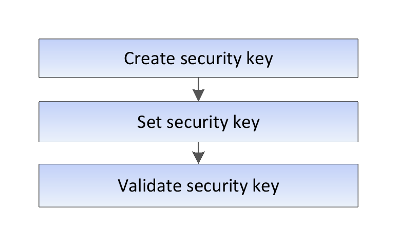

= Getting started with internal key management
:icons: font
:imagesdir: ./media/

[.lead]
A security key is a string of characters, which is shared between the secure-enabled drives and controllers in a storage array. When using internal key management, you create and maintain security keys on the controller's persistent memory.

See SANtricity System Manager online help for conceptual information on using internal security keys. The following graphic shows the basic workflow for using internal security keys:

== Workflow steps

The following commands get you started with internal security keys:

. Create a storage array security key, using the `create storageArray securityKey` command. See xref:reference_wombat_create_storagearray_securitykey.adoc[Creating a storage array security key].
. Set the storage array security key, using the `set storageArray securityKey` command. Seexref:reference_wombat_set_storagearray_securitykey.adoc[Setting a storage array security key].
. Validate the security key, using the `validate storageArray securityKey` command. See xref:reference_wombat_validate_storagearray_securitykey.adoc[Validating a storage array security key].
